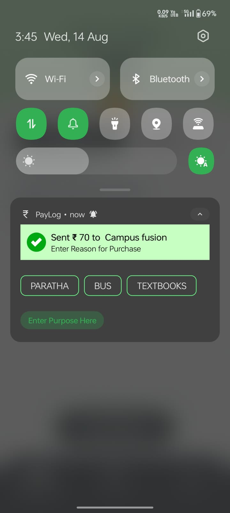
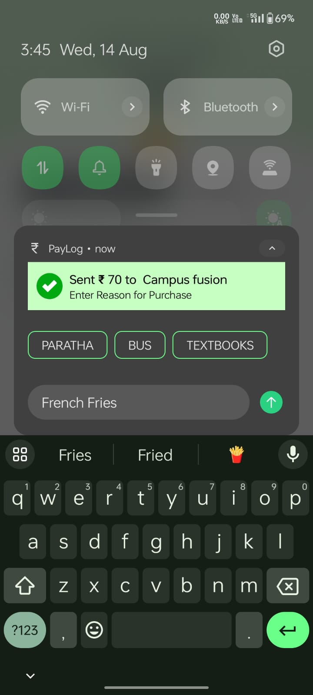
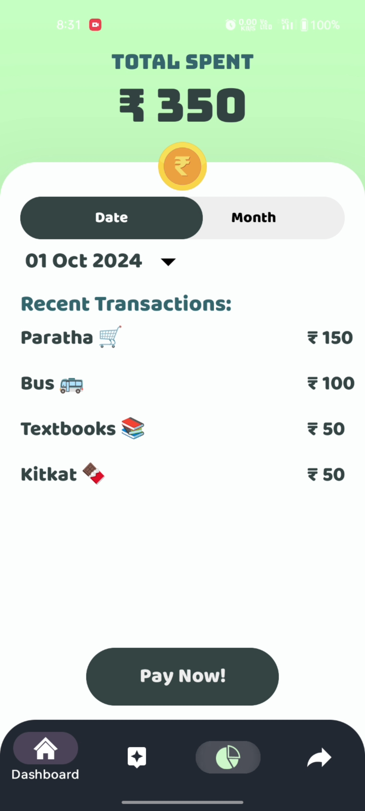
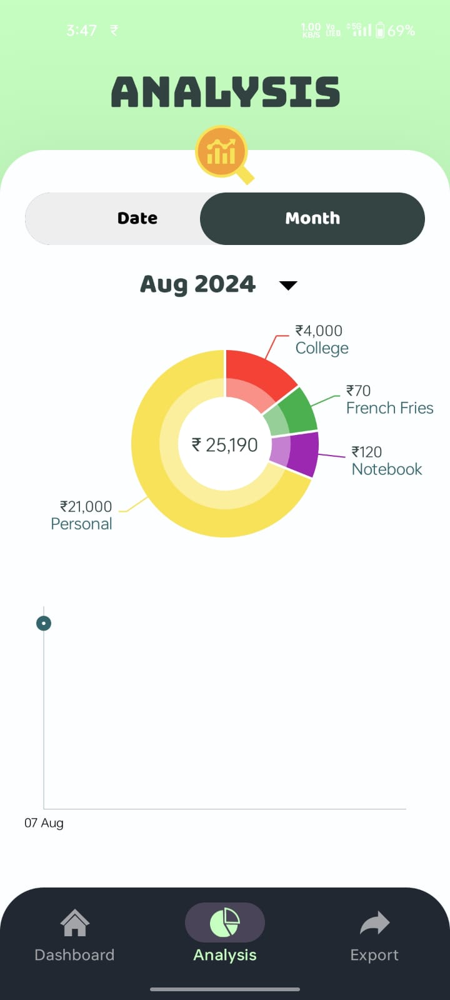
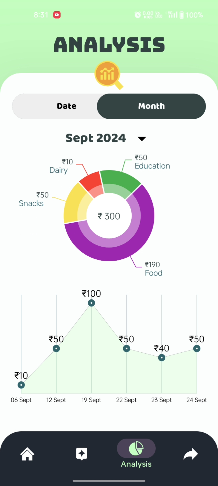

# Paylog Application

## Overview

Paylog is an innovative expense tracker app designed to monitor expenses in real-time. Unlike other expense tracker apps, Paylog prompts you to provide the purpose of each payment immediately after it's made, eliminating the need to remember and log expenses later. This feature ensures accurate and timely expense tracking, making Paylog an ideal solution for businesses and individuals who frequently make payments.

## Screenshots

Below are some screenshots of the application:


<div>
    
    
    
</div>
<div>
    
    
    
</div>


## Features

- **Real-Time Expense Logging**: As soon as a payment is made, Paylog asks for the purpose, ensuring you never forget the reason for any transaction.
- **Clear Dashboard**: View a comprehensive dashboard with detailed analysis of your expenses.
- **Analysis and Export**: Visualize your payment history with pie charts and line graphs. Export your data to Excel for further analysis.
- **Memory Efficient**: Paylog does not need to run continuously in the background, making it memory efficient.
- **Frequent Merchant Updates**: Even for the same merchant, Paylog prompts for the purpose of each transaction, as different products can be purchased from the same merchant.

## Use Case

Paylog is perfect for businesses and individuals who make frequent payments and need a reliable method to track their expenses. The app was inspired by the developer's relative who manually recorded payments with pen and paper.

## Requirements

- **UPI App**: Ensure your UPI app is enabled to send payment information to Gmail.

## Future Plans

- **OpenAI API Integration**: Implement OpenAI API to automatically categorize payment purposes and generate insights.
- **Personal Chatbot**: Develop a personal chatbot to assist with expense tracking and provide insights.

## Installation

1. Clone the repository:
    ```bash
    git clone https://github.com/akgupta1337/PayLog
    ```
2. Open the project in Android Studio.
3. Sync the project with Gradle files.
4. Run the app on your Android device.

## Usage

1. Make a payment using PayLog app (It will redirect you to PhonePe).
2. Paylog will prompt you to enter the purpose of the payment immediately.
3. View your payment history, analysis, and export options in the app.


## License

This project is licensed under the MIT License.


