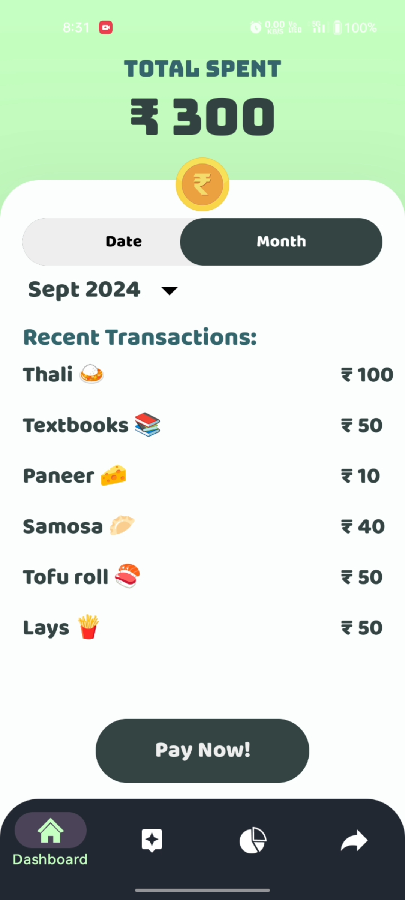

# Paylog Application

## Overview

In business, we conduct many transactions online, making it crucial to track every penny and understand where it’s going. Often, businesses make 10-100 payments every day, which need to be recorded. However, it's not feasible to write down the purpose of each transaction on paper or in an Excel sheet. Over time, you may even forget the reason, leading to frustration and poorly managed finances.

To tackle this problem, I came up with an idea. What if, every time we made a payment, we were immediately notified on an app, showing the payment made to a specific person and asking us to enter the payment reason on the spot? What's even better is that once we make a payment to that person, our system will recognize and remember it, so we don’t have to type it out again. We could further integrate AI to help categorize payments automatically, offering full insights into transactions, along with assistance, suggestions, and more. Users could also export their data to Excel sheets or visualize it directly in the app.

That’s how PayLog was born—an idea inspired by my uncle's logistics business, where his employees manually recorded payment information on paper.
## Screenshots

Below are some screenshots of the application:


<div>
    
    
    
</div>
<div>
    
    
    
</div>
<div>
    
    
    
</div>


## The Problem

The biggest problem I faced while making this app was figuring out how to get information about the payment when it is made.

First, I tried asking the user to enter the amount in our app and scan a QR code, then redirect them to their UPI app with payment and sender information autofilled. However, this failed because most UPI apps don't allow this due to security reasons.

## Solutions

Second, I thought about what actions are triggered every time a payment occurs. I found that SMS notifications were one of them. However, after making some random payments, I discovered that banks do not always send SMS for every payment.

Third and finally, I had lost all hope until I opened my Gmail and saw that all the payments I made through PhonePe were there. That's when it clicked. I sat down, studied IMPS, and the Jakarta Mail API, and got it working.  


## Finally

After getting the Gmail API working and being able to write a function that reads messages from a certain label in your inbox and parses them into date, amount, and receiver (which is not very secure since I had to use my app password to get Gmail access), I had to devise a way to run it in the background. 

Earlier in the development phase, I thought of running it every second, all day long, which would make too many requests in a day and was not feasible. Another dumb idea I had was to run it only when PhonePe was running in the background, but that required a lot of permissions.

Finally, one day, my genius struck, and I realized I could just force the user to use my app and click on a button to open PhonePe from there. When they click, I start my mail-reading service and stop it 1-2 minutes later when the app is closed. This solution was both efficient and phone-friendly.


## Features

- **Real-Time Expense Logging**: As soon as a payment is made, Paylog asks for the purpose, ensuring you never forget the reason for any transaction.
- **Clear Dashboard**: View a comprehensive dashboard with detailed analysis of your expenses.
- **Analysis and Export**: Visualize your payment history with pie charts and line graphs. Export your data to Excel for further analysis.
- **Memory Efficient**: Paylog does not need to run continuously in the background, making it memory efficient.
- **AI-Powered**: PayLog leverages AI to automatically categorize transactions, providing valuable insights and helping you manage your finances effortlessly.

## Use Case

Paylog is perfect for businesses and individuals who make frequent payments and need a reliable method to track their expenses. The app was inspired by the developer's relative who manually recorded payments with pen and paper.

## Requirements

- **UPI App**: Ensure your UPI app is enabled to send payment information to Gmail.

## Future Plans

- **GoogleGemini(coz its free) API Integration**: Implement OpenAI API to automatically categorize payment purposes and generate insights.(done)
- **Personal Chatbot**: Develop a personal chatbot to assist with expense tracking and provide insights.(done)
- **Cash Flow Insights**: Enhance the app's analytics by providing cash flow-based insights. This could help users understand their financial health better, making it easier for them to apply for loans.
- **Financial Literacy Tools**: Add educational resources or tools that promote financial literacy. This could include tips on managing expenses, understanding credit scores, and how to improve creditworthiness.
- **Creditworthiness Assessment**: Implement a feature that analyzes users' spending and payment history to provide insights into their creditworthiness, which could be beneficial when seeking loans.

## Installation

1. Clone the repository:
    ```bash
    git clone https://github.com/akgupta1337/PayLog
    ```
2. Open the project in Android Studio.
3. Sync the project with Gradle files.
4. Run the app on your Android device.

## Usage

1. Make a payment using PayLog app (It will redirect you to PhonePe).
2. Paylog will prompt you to enter the purpose of the payment immediately.
3. View your payment history, analysis, and export options in the app.


## License

This project is licensed under the MIT License.


